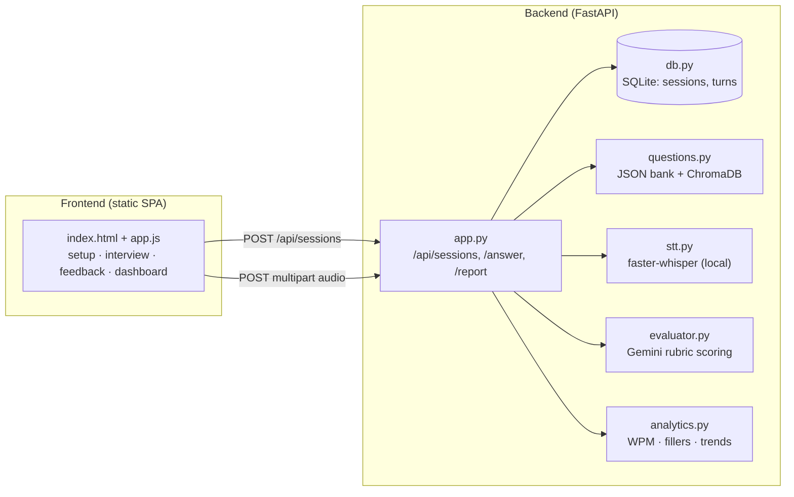
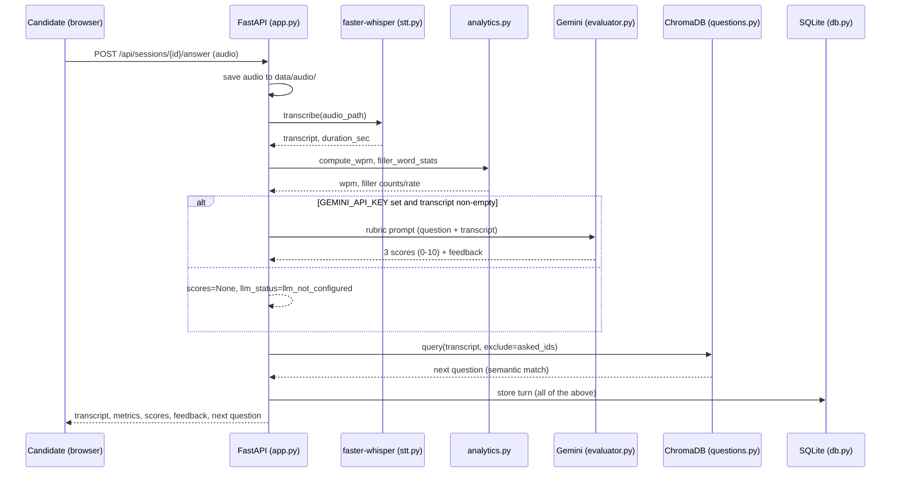

# AI Mock Interview Coach - Architecture

## Module diagram

## Data flow for one answer turn

## Key design decisions
- **Local-first STT**: raw audio never leaves the machine; faster-whisper `base`
  runs on CPU (override with `WHISPER_MODEL`). Only the text transcript is sent
  to Gemini, and only when `GEMINI_API_KEY` is set. (`stt.py` decodes audio via
  PyAV itself and passes a waveform to faster-whisper, because the pinned
  faster-whisper 1.2.1 passes a `metadata_errors` keyword that the pinned
  PyAV 19.0.0 removed.)
- **Graceful LLM degradation**: every turn is fully usable without a Gemini key.
  Transcript + local metrics are always computed; the API reports
  `llm_not_configured` honestly instead of failing.
- **Deterministic question flow**: the first question is the first bank entry
  matching the difficulty; follow-ups re-derive deterministically from
  (previous transcript, asked ids, difficulty), so backend and frontend agree
  on the current question without extra state.
- **Pure-function DS layer**: `analytics.py` has no I/O, so it is trivially testable
  and easy to demo to a review panel.
- **SQLite**: zero-setup persistence; the DB file lives in `backend/data/`.
